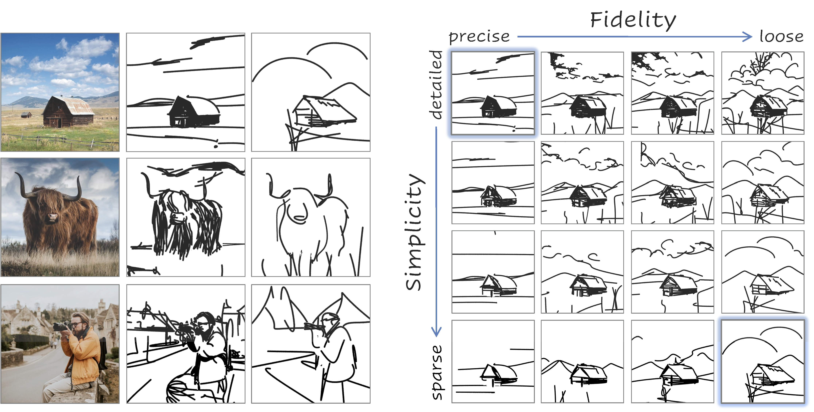

# CLIPascene: Scene Sketching with Different Types and Levels of Abstraction

[](https://arxiv.org/abs/2211.17256)
[[Project Website](https://clipascene.github.io/CLIPascene/)]
<br>
<br>
This is the official implementation of CLIPascene, a method for converting a scene image into a sketch with different types and multiple levels of abstraction. We disentangle abstraction into two axes of control: fidelity and simplicity. <br>
Our method generates a whole matrix of sketches for a given input image. <br>




At a high level, given an input image of a scene, we seperate the image intot two regions - the foreground and background.
We then sketch each of them independently, and create a corresponding matrix of abstractions for each.
We then combine the two matrices into one. we define a sketch as a set of Bézier curves and train two MLP networks -- one to leran the strokes locations, and the second to learn how to gradually remove select strokes from a given sketch. <br>
<br>

## Installation via Docker
You can simply pull the docker image from docker hub, containing all the required libraries and packages:
```bash
docker pull yaelvinker/clipascene
docker run --name clipascene -p 8888:8888 --gpus all -it yaelvinker/clipascene /bin/bash
```
Now you should have a running container.
Inside the container, go to /home directory, and clone the repository:

```bash
cd /home
git clone https://github.com/yael-vinker/SceneSketch.git
cd SceneSketch/
```

Next, download the U2Net weights:
```bash
wget https://huggingface.co/akhaliq/CLIPasso/resolve/main/u2net.pth --output-document=U2Net_/saved_models/u2net.pth
```
and the LAMA model:
```bash
cd lama/
curl -L $(yadisk-direct https://disk.yandex.ru/d/ouP6l8VJ0HpMZg) -o big-lama.zip
unzip big-lama.zip
```

Now you are all set and ready to move to the next stage (Run Demo).


## Run Demo
### Image Preprocessing
The input scene images should be provided in __png format__, and should be located under "./target_images/scene". <br>
Please provide a __square__ image with a reasonable size (maximum ~500px). <br>
For the best performances, we split the scene image into foreground and background, and sketch each seperately. <br>
If you wish to apply our method without the split, you can move on to the next stage (Start Sketching). <br>
Otherwise, run:
```bash
python preprocess_images.py
```
<br>
<br>

__This script will__: 
<br>
* Apply our preprocess for all scene images under "./target_images/scene".

* Generate a mask image using U2Net (saved under "target_images/scene/<im_name>_mask.png") 

* Generate the inpainted background image guided by the mask, using LAMA (saved under "target_images/background/<im_name>_mask.png") 

Note that you can also directly use [this LAMA demo](https://huggingface.co/spaces/akhaliq/lama) with the "U2Net" option, and just locate the resulting inpainted background under "target_images/background/<im_name>_mask.png".

### Start Sketching
As mentioned in the paper, we first generate the first row (fidelity axis) and then for each sketch in the row we generate the corresponding simplified sketches along the simplicity axis. <br> 
To run this pipeline, use the "run_all.py" script (under scripts), by simply running:
```bash
python scripts/run_all.py --im_name <im_name>
```
For example, on the ballerina image:
```bash
python scripts/run_all.py --im_name "ballerina"
```
The resulting sketches will be saved to the "results_sketches/<im_name>" folder, in SVG and png format.

If you want to run foreground and background sketching in parallel (in case you have more than a single GPU, this is recommended), you can simply run them in separate using:
```bash
python scripts/run_background.py --im_name "ballerina"
```
and:
```bash
python scripts/run_foreground.py --im_name "ballerina"
```


Once the script have finished running (this can take up to few hours, for faster version and layer selection see "Play with the scripts" below), you can visualize the results using:
```bash
python scripts/combine_matrix.py --im_name <im_name>
```
<br>
The resulting matrixes and SVGs for the "ballerina" image are provided under "results_sketches/ballerina"
<br>

### Play with the scripts

If you want to run our method for spesific fidelity or simplicity levels, you can use the dedicated scripts under "scripts", spesifically:
* ```generate_fidelity_levels.py``` - generates a single sketch at a given fidelity layer. <br>
    For background, run with:
    ```bash
    python scripts/generate_fidelity_levels.py --im_name <im_name> --layer_opt <desired_layer> --object_or_background "background"
    ```
    For objects, run with:
    ```bash
    python scripts/generate_fidelity_levels.py --im_name <im_name> --layer_opt <desired_layer> --object_or_background "object" --resize_obj 1
    ```
* ```run_ratio.py``` - generates a single column of simplified sketches, for a given fidelity level. <br>
    For background, run with:
    ```bash
    python scripts/run_ratio.py --im_name <im_name> --layer_opt <desired_layer> --object_or_background "background" --min_div <step_size>
    ```
    For objects, run with:
    ```bash
    python scripts/run_ratio.py --im_name <im_name> --layer_opt <desired_layer> --object_or_background "object" --min_div <step_size> --resize 1
    ```
    Where <step_size> is the parameter to sample the function f_k (as described in the paper). You can find the spesific parameters under   "scripts/run_all.py" 


## Tips for efficiency

* Note that the provided scripts assume only one GPU, so all processes run sequentially. <br>
If you have multiple GPUs, you can run Background and Foreground sketches in parallel. (use scripts/run_background.py, scripts/run_foreground.py)

* If you run on multiple GPUs, you can also parallel the simplicity axis generation across different layers, by specifying spesific layers to "scripts/run_ratio.py"

* Additionally, you can use less steps in "scripts/generate_fidelity_levels.py" - currently num_iter is set to 1500, however, after ~500 steps you can already get quite a reasonable scale.

* You can additinally generate less levels along the simplicity axis, by modifying the "num_ratios" parameter in "get_ratios_dict".
